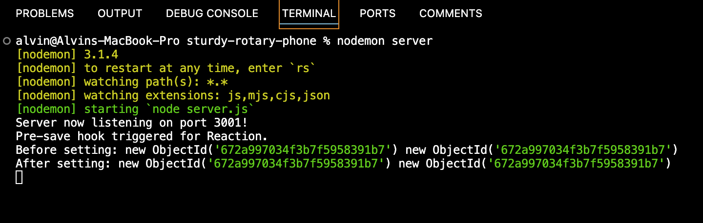

# NoSQL: Social Network API

## Description
An API for a social network web application where users can share their thoughts, react to friends’ thoughts, and create a friend list
## Table of Contents
- [Installation](#installation)
- [Usage](#usage)
- [Screenshots](#screenshots)
- [License](#license)
- [Contributors](#Contributors)
- [Tests](#tests)
- [Questions](#questions)
## Installation
TBD
## Usage
TBD
## License
      This project is licensed under the MIT license.
## Screenshots

## Contributors
@alvin-est
## Tests
N/A
## Questions
If you have any questions, please contact me at [contact@alvin-the.dev](mailto:contact@alvin-the.dev). You can also find me on GitHub at [@alvin-est](https://github.com/@alvin-est).  
