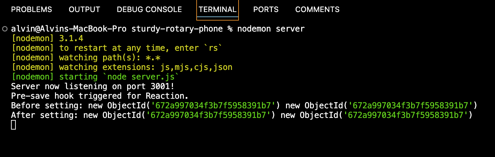
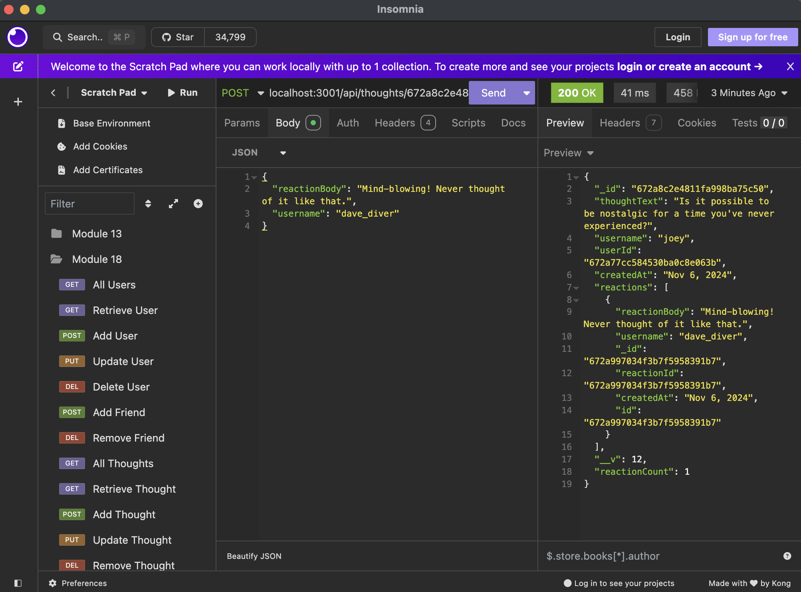

# NoSQL: Social Network API

## Description
An API for a social networking web application where users can share their thoughts, react to friends’ thoughts, and create a friend list

Walkthrough video: https://youtu.be/7e37LFHszc0
## Table of Contents
- [Installation](#installation)
- [Usage](#usage)
- [Screenshots](#screenshots)
- [License](#license)
- [Contributors](#Contributors)
- [Tests](#tests)
- [Questions](#questions)
## Installation
This application uses the NodeJS runtime environment. Make sure you have this installed. This is also using MongoDB for the database. Please install on your workstation before running.
1. Clone the repo on your localhost or remote server.

2. Navigate into the server folder using Terminal

3. Edit the .env.template file to add your MongoDB URI and rename this to .env  
If running locally, it should look like the below:
`MONGODB_URI=mongodb://localhost/[your_db_name]`

4. Run the commands:
- *npm install*
- *npm start*

The server should now be running (by default on port 3001).

## Usage
The following API endpoints and their functionalities are listed below:

> **/api/users**
- **GET** all users
- **GET** a single user by its _id 
- **POST** a new user
- **PUT** to update a user by its _id
- **DELETE** to remove user by its _id

> **/api/users/:userId/friends/:friendId**
- **POST** to add a new friend to a user's friend list
- **DELETE** to remove a friend from a user's friend list

> **/api/thoughts**
- **GET** to get all thoughts
- **GET** to get a single thought by its _id
- **POST** to create a new thought 
- **PUT** to update a thought by its _id
- **DELETE** to remove a thought by its _id

> **/api/thoughts/:thoughtId/reactions**
- **POST** to create a reaction stored in a single thought's reactions array field
- **DELETE** to pull and remove a reaction by the reaction's reactionId value

You will need a tool such as [Insomnia](https://insomnia.rest) (or curl for CLI) to interact with the API endpoints and send the relevant requests.
## License
      This project is licensed under the MIT license.
## Screenshots

## Contributors
[@alvin-est](https://github.com/@alvin-est)
## Tests
None yet.
## Questions
If you have any questions, please contact me at [contact@alvin-the.dev](mailto:contact@alvin-the.dev). You can also find me on GitHub at [@alvin-est](https://github.com/@alvin-est).  
